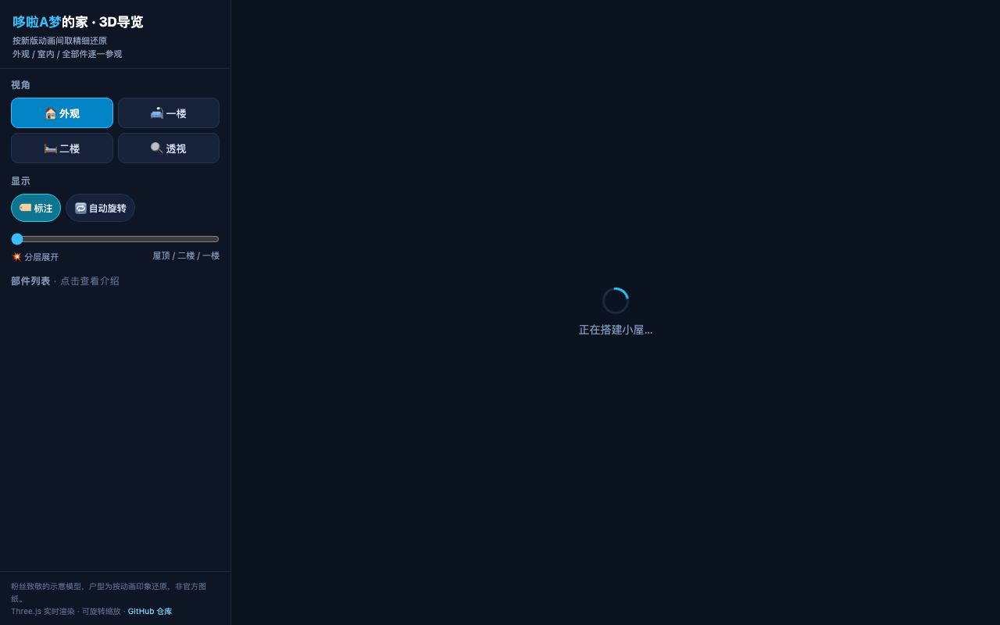

# Doraemon House 3D / 哆啦A梦的家 3D导览

中文：基于 Three.js 制作的野比大雄家 3D 立体导览。按新版动画精细还原，支持外观、一楼、二楼及透视视角切换、层级分层展开、自动旋转与空间部件点击导览。

English: Interactive 3D walk-through of Nobita Nobi's house from Doraemon built with Three.js. Features exterior, first floor, second floor, and X-ray viewpoints, exploded floor view controls, and interactive room labels.



## 在线体验 / Live Demo

- [Cloudflare Demo](https://doraemon-house-3d.xiaosang.cc/)
- [GitHub Repo](https://github.com/holynova/doraemon-house-3d)


## 本地运行 / Run locally

```bash
open index.html
```

## 发布 / Deploy

```bash
npx wrangler deploy --config wrangler.jsonc
```

Cloudflare Workers · Custom Domain: `doraemon-house-3d.xiaosang.cc`

源码与部署配置使用同一个主分支；在本地手动发布，不创建 Cloudflare 专用分支或 GitHub Action。
